# Insight-Daily-MobWeb-App
Insight-Daily-MobWeb App
<h1 align="center">📰 Insight Daily - Your Customizable News Web & Mobile App</h1>

<p align="center">
  <a href="https://insight-daily-mob-web-app.vercel.app/"><strong>Live Demo</strong></a>   •   
  <a href="https://contact-form-react-sepia.vercel.app/"><strong>Contact Me</strong></a>
</p>

<p align="center">
  
  
  
  
  
</p>

**Insight Daily** is a sleek and responsive web & mobile-friendly news application built with **React** and styled using **CSS**, delivering real-time global headlines. Powered by [NewsAPI.org](https://newsapi.org/), it allows users to **customize their news feed** by choosing categories they care about the most.

---

## ✨ Features

- 🆕 **Latest Headlines**  
  Stay updated with breaking news from around the world.

- ⚙️ **Category-Based Feed**  
  Choose from various categories including business, health, technology, sports, entertainment, and science.

- 📱 **Responsive Design**  
  Fully responsive and works great on web, tablet, and mobile screens.

- 🧠 **Redux Toolkit**  
  Efficient and scalable global state management with `@reduxjs/toolkit`.

- 📦 **Axios Integration**  
  Cleanly fetches data from the NewsAPI with error handling and loading states.

---

## 🏗️ Project Structure

1. For Web App:

```plaintext
BNews-web-app/
├── node_modules/
├── public/
├── src/
│   ├── component/
│   ├── SplashScreenAssets/
│   ├── App.css
│   ├── App.js
│   ├── App.test.js
│   ├── index.css
│   ├── index.js
│   ├── logo.svg
│   ├── reportWebVitals.js
│   ├── sampleOutput.json
│   └── setupTests.js
├── .env
├── .gitignore
├── LICENSE
├── package-lock.json
├── package.json
├── vercel.json

```
2. For Mobile App (using React Native):

```plaintext
BNews-mobile-app/
├── .expo/                   # Expo-generated metadata
├── app/                     # Navigation and main screens
├── assets/                  # Fonts, images, splash screen assets, etc.
├── components/              # Reusable UI components
├── constants/               # App-wide constants like colors, fonts, etc.
├── node_modules/            # Dependencies
├── .gitignore               # Files and folders to be ignored by Git
├── app.json                 # Expo app configuration
├── babel.config.js          # Babel configuration
├── env.tsx                  # Environment-specific config (e.g., API keys)
├── expo-env.d.ts            # TypeScript support for Expo environment variables
├── LICENSE                  # License file
├── metro.config.js          # Metro bundler configuration
├── package-lock.json        # Lock file for dependencies
├── package.json             # Project metadata and scripts
└── tsconfig.json            # TypeScript configuration

```

---

## 🛠️ Installation

To run this project locally:

```bash
    git clone https://github.com/deepanshubajaj/Insight-Daily-MobWeb-App.git
```

1. For Web:

```bash
    cd BNews-web-app
```
```bash
    npm install
```
```bash
    npm start   # To start the application
```

Once the development server is up and running, open your web browser and go to `http://localhost:3000` to see the project in action.

2. For Mobile (iOS or Android):

```bash
    cd BNews-mobile-app
```
```bash
    npm install
```
```bash
    npx expo start   # To start the application
```

Then -
- press 'i' to run app in iOS &
- press 'a' to run in Android

---

## ⚙️ Set up environment variables

1. Create **.env** file for **BNews-web-app**

```env
# .env file for Insight Daily react web app

REACT_APP_API_KEY=your_news_api_key

# Other Configuration
REACT_APP_CREATOR_NAME=your_name
REACT_APP_FACEBOOK=your_facebook_url
REACT_APP_INSTAGRAM=your_instagram_url
REACT_APP_LINKEDIN=your_linkedin_url
REACT_APP_GITHUB=your_github_url
REACT_APP_TWITTER=your_twitter_url

# Others
CI=false
```

2. Create **.env** file for **BNews-mobile-app**

```env
// env.tsx file for Insight Daily react-native mobile app
// Environment variables and sensitive configuration

export const ENV = {
  // Contact information
  CONTACT_EMAIL: "your_email_id",
  
  // Social media links
  SOCIAL_LINKS: {
    GITHUB: "your_github_url",
    FACEBOOK: "your_facebook_url",
    LINKEDIN: "your_linkedin_url",
    TWITTER: "your_twitter_url",
    INSTAGRAM: "your_instagram_url",
    PORTFOLIO: "your_website/portfolio_url"
  },
  
  // API keys
  NEWS_API_KEY: "your_news_api_key"
};
```

---

## 🛠 Technologies Used

### 🖥️ React Web App Stack (CRA)

| Technology               | Description                                                  |
|--------------------------|--------------------------------------------------------------|
| ⚛️ **React (CRA)**         | Create React App setup for building web interfaces           |
| 🧠 **Redux Toolkit**       | Predictable and efficient global state management            |
| 🌐 **Context API**         | Lightweight state sharing across components (e.g., auth)     |
| 🎨 **CSS / SCSS**          | Styling with modular or enhanced syntax                      |
| 📰 **NewsAPI**             | Real-time news content integration                           |
| 📦 **Axios**               | HTTP client for API interactions                            |
| 🛣️ **React Router DOM**     | Routing and navigation for SPA behavior                      |
| ⚙️ **CRA Scripts & Config** | Built-in tooling and scripts for dev/build/test              |
| ✅ **Jest / React Testing Library** | Unit and component testing                     |

---

### 📱 React Native Mobile App Stack

| Technology               | Description                                                  |
|--------------------------|--------------------------------------------------------------|
| ⚛️ **React Native**         | Framework for building native mobile apps with React        |
| 🧠 **Redux Toolkit**         | Centralized state management for scalable apps              |
| 🌐 **Context API**           | Simplified shared state (e.g., theme, auth)                 |
| 🎨 **Styled Components**     | CSS-in-JS styling for component-level customization         |
| 📰 **NewsAPI**               | Integration for real-time news content                      |
| 📦 **Axios**                 | API calls and HTTP requests                                 |
| 🧭 **React Navigation**      | Navigation and routing for mobile screens                   |
| ⚙️ **Expo / Metro**          | Development tools and bundler for RN                        |
| ✅ **Jest / Detox**          | Testing tools for unit and end-to-end testing               |

---

## ⚙️ API Reference & Usage

### 📰 NewsAPI.org


- **Source**: [https://newsapi.org](https://newsapi.org)
- **Purpose**: Fetches real-time news articles based on category, search keyword, and region.
- **Authentication**: Requires an API key via `REACT_APP_NEWS_API_KEY` in `.env`.

Example usage:
```js
axios.get(`https://newsapi.org/v2/top-headlines?category=technology&apiKey=${API_KEY}`);
```

---

## 🖼️ App Icon

<p align="center">
  
</p>

<p align="center">
  *This is the App Icon.*
</p>

---

## 🖼️ Screenshots

1. Snapshots in Web App:

<p align="center">
  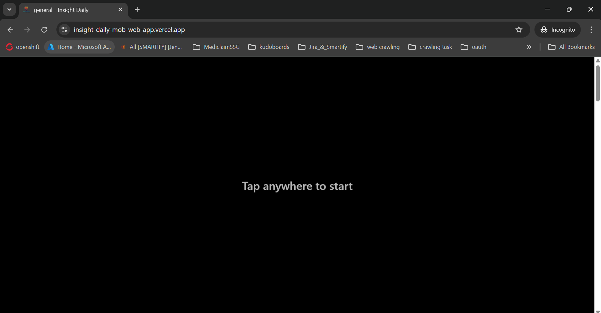
</p>

##

<p align="center">
  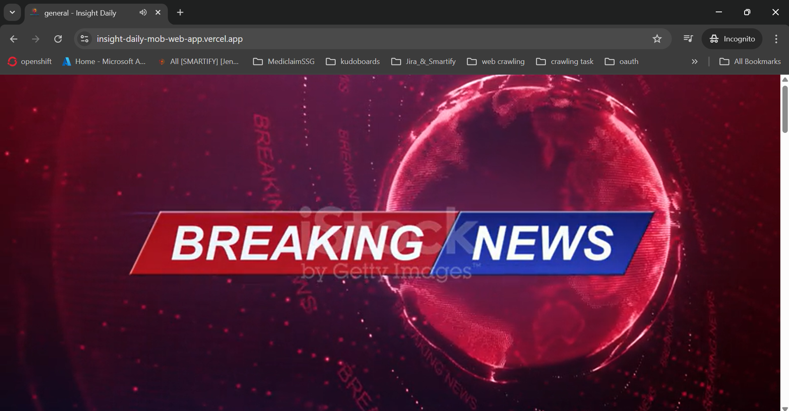
</p>

##

<p align="center">
  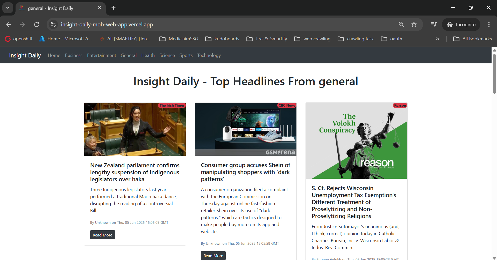
</p>

##

<p align="center">
  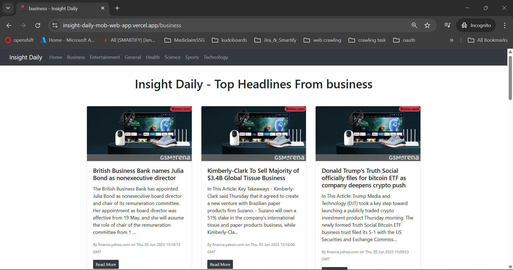
</p>

##

<p align="center">
  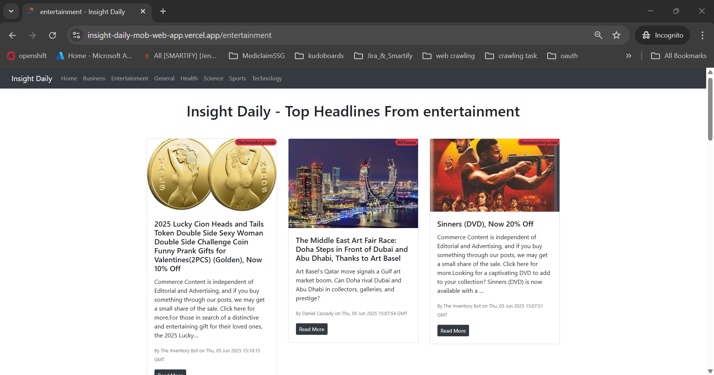
</p>

##

<p align="center">
  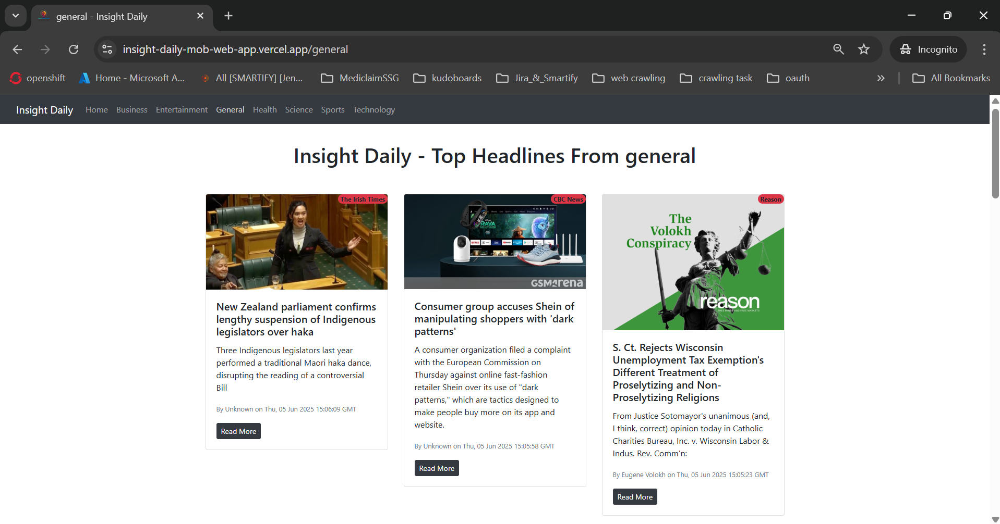
</p>

##

<p align="center">
  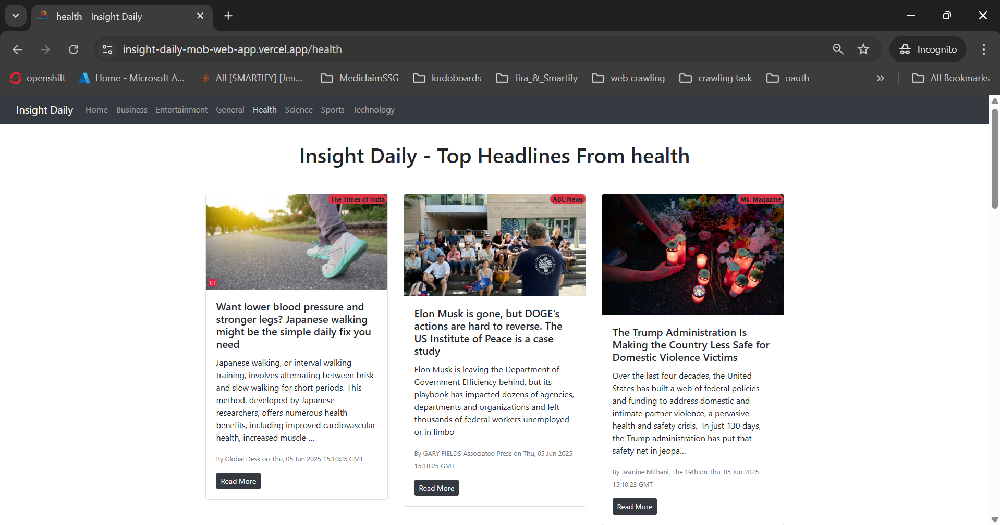
</p>

##

<p align="center">
  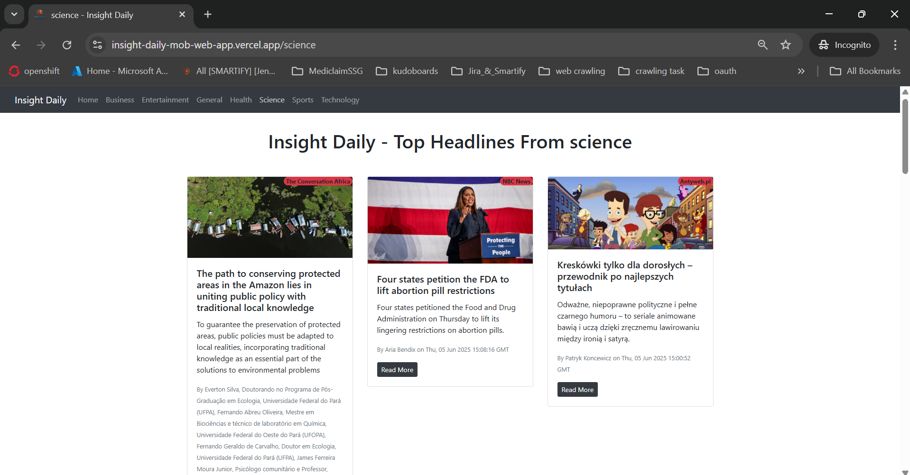
</p>

##

<p align="center">
  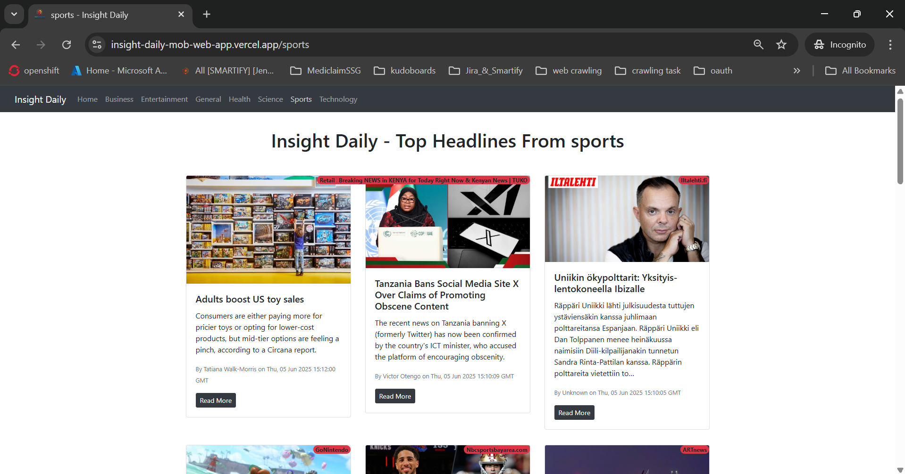
</p>

##

<p align="center">
  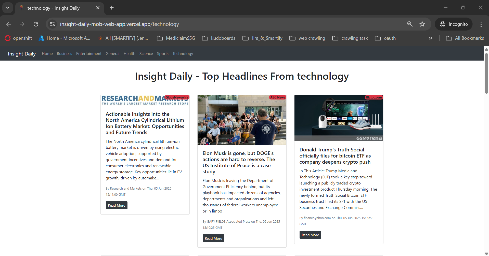
</p>

##

<p align="center">
  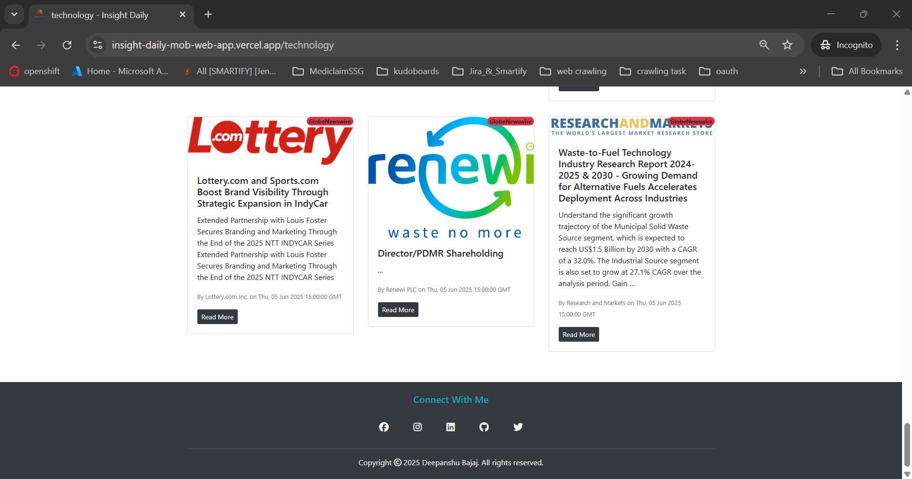
</p>

##

<p align="center">
  *Snapshots of the Running Application*
</p>

---

## 🚀 Video Demo

Here’s a short video showcasing the app's functionality:

[Watch the Working Demo](https://github.com/user-attachments/assets/928202a6-33a9-4238-b5bc-0296ab213eb9)

##

➤ <a href="ProjectOutputs/WorkingVideos/WorkingVideo.mp4">🎥 Watch Working Video</a>

---

## 🤝 Contributing

Thank you for your interest in contributing to this project!  
I welcome contributions from the community.

- You are free to use, modify, and redistribute this code under the terms of the **Apache-2.0 License**.
- If you'd like to contribute, please **open an issue** or **submit a pull request**.
- All contributions will be reviewed and approved by the author — **[Deepanshu Bajaj](https://github.com/deepanshubajaj?tab=overview&from=2025-03-01&to=2025-03-31)**.

---

## 📌 How to Contribute

To contribute:

1. Fork the repository.

2. Create a new branch:
   ```bash
   git checkout -b feature/your-feature-name
   ```

3. Commit your changes:
   ```bash
   git commit -m 'Add your feature'
   ```

4. Push to the branch:
   ```bash
   git push origin feature/your-feature-name
   ```

5. Open a pull request.

---

## 📃 License

This project is licensed under the [Apache-2.0 License](./LICENSE).  
You are free to use this project for personal, educational, or commercial purposes — just make sure to provide proper attribution.

> **Clarification:** Commercial use includes, but is not limited to, use in products,  
> services, or activities intended to generate revenue, directly or indirectly.

---

## 📩 Contact

You can reach out to me [here](https://contact-form-react-sepia.vercel.app/).
